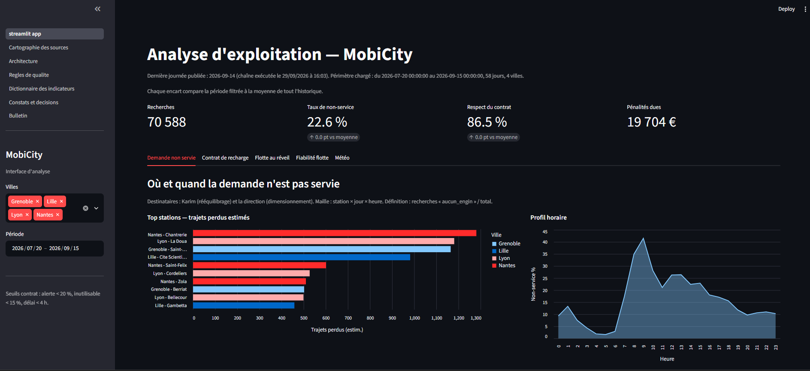
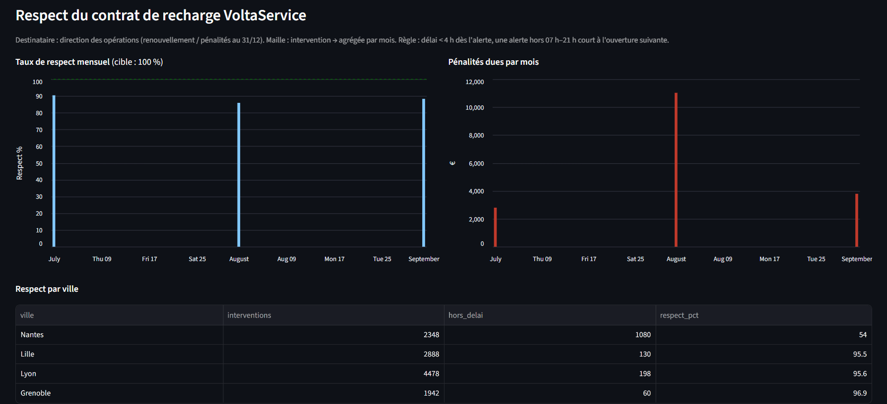
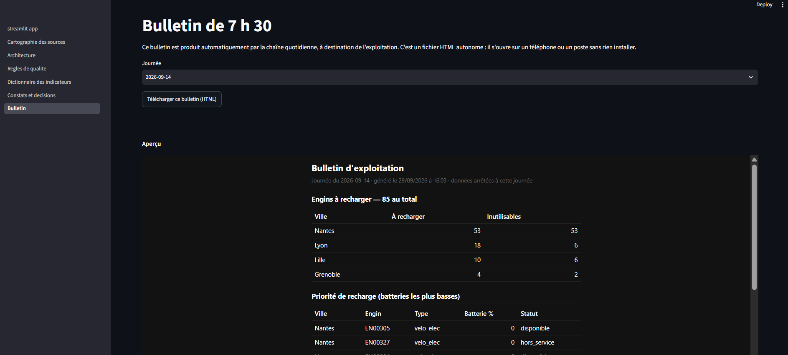

# E05 — Application d'analyse et d'automatisation (mobilité partagée)

Chaîne décisionnelle **Bronze → Silver → Gold**, **interface d'analyse** multipage, et
**chaîne quotidienne automatisée** qui produit chaque matin le bulletin d'exploitation
de 7 h 30. Le tout tourne sur un poste local, sans service payant et sans connexion
externe. Tout se régénère depuis le code et les données : l'archive ne contient ni les
données sources, ni les couches produites — elles sont reconstruites à la demande.

---

## 1. Contexte

MobiCity est un opérateur (fictif) de trottinettes et vélos en libre-service présent
dans quatre villes — **Lyon, Nantes, Lille et Grenoble** — avec environ 600 engins et
58 stations, en fin de phase pilote. Trois questions concrètes structurent tout le projet :

1. **Demande non servie** — combien de fois un client cherche un engin et n'en trouve pas,
   où et quand, et ce que cela représente en manque à gagner.
2. **Contrat de recharge (SLA)** — le prestataire doit recharger les engins déchargés en
   moins de 4 h ; le contrat arrive à échéance et il faut décider de le reconduire ou non,
   chiffres de respect et de pénalités à l'appui.
3. **Bulletin du matin de Karim** — l'exploitant préparait à la main, chaque matin, la liste
   des engins à recharger et des stations à réalimenter. La décision se prend vers 7 h 55,
   le camion part à 8 h : le bulletin doit être prêt, fiable et lisible **avant 7 h 30**.

Le projet répond aux trois : les deux premières via l'interface d'analyse, la troisième via
la chaîne automatisée.

---

## 2. Architecture

L'architecture suit le motif **medallion**, en trois couches, chacune avec une
responsabilité claire :

```
   Sources brutes                 Bronze                Silver                 Gold
 (CSV / JSON / JSONL /        ingestion fidèle,   normalisation, dédup.,   indicateurs prêts
  .gz, référentiels)          traçabilité du       contrôles qualité,       à l'emploi, par
                              lignage              RGPD, quarantaine        question métier
        │                        │                     │                       │
        └──── extraction ───────►└──── transform ─────►└──── agrégation ──────►└──► interface
                                                                                    + bulletin
```

- **Bronze** : les données sont ingérées telles quelles, avec la trace de leur fichier
  d'origine (lignage). Aucune interprétation à ce stade.
- **Silver** : normalisation (dates ramenées à un format unique, villes reprises du
  référentiel qui fait autorité), déduplication sur clé métier, application des règles de
  qualité, pseudonymisation. Les lignes non conformes sont écartées en **quarantaine** avec
  le motif du rejet.
- **Gold** : tables d'indicateurs, une par question métier, directement lisibles par
  l'interface et le bulletin.

Le détail et la justification des choix figurent dans `dossier/01_architecture_et_justifications.md`.

---

## 3. Choix techniques

| Composant | Choix | Pourquoi |
|-----------|-------|----------|
| Langage | **Python 3.11+** | Standard de la data, lisible, sans compilation. |
| Moteur | **DuckDB** | Base analytique en un seul fichier, SQL complet, aucune installation de serveur ; idéale pour un poste local. |
| Stockage analytique | **Parquet partitionné par jour** | Lecture colonne très rapide ; requêtes filtrées sur une journée en quelques millisecondes. |
| Interface | **Streamlit** | Tableau de bord interactif en Python pur, sans front-end à maintenir. |

Le passage par Parquet partitionné est mesuré dans le dossier : une requête filtrée sur une
journée passe d'un balayage complet des fichiers bruts (**~3 à 5 s**) à **~7 à 15 ms** sur la
couche Parquet, soit un facteur plusieurs centaines. DuckDB est choisi pour le volume réel du
pilote (~1,6 million de lignes de télémétrie) ; la logique SQL resterait transposable sur un
moteur distribué si les volumes changeaient d'ordre de grandeur.

---

## 4. Contenu de l'archive

```
E05/
├── README.md                 # ce fichier
├── requirements.txt          # dépendances Python
├── code/
│   ├── build.py              # construit l'historique (couches + indicateurs + dossier)
│   ├── jour.py              # chaîne quotidienne : traite une journée jusqu'au bulletin
│   ├── dossier.py           # régénère seulement la documentation technique
│   ├── src/
│   │   ├── config.py        # chemins, seuils du contrat, paramètres (auto-détection des données)
│   │   ├── etl.py           # Bronze + Silver : ingestion, normalisation, qualité, RGPD
│   │   ├── gold.py          # construction des tables d'indicateurs (Gold)
│   │   ├── run_backfill.py  # rejoue tout l'historique (Bronze + Silver + export Parquet/CSV)
│   │   ├── orchestrateur.py # chaîne quotidienne : étapes, journal, porte qualité, reprises
│   │   ├── run_jour.py      # interface en ligne de commande de la chaîne
│   │   ├── bulletin.py      # génération du bulletin HTML de 7 h 30
│   │   └── build_dossier.py # génère la documentation technique depuis l'entrepôt
│   └── app/
│       ├── streamlit_app.py # accueil du tableau de bord (filtres, KPIs, onglets)
│       ├── _shared.py       # helpers partagés (connexion, requêtes, mise en forme)
│       └── pages/           # pages : cartographie, architecture, qualité, dictionnaire,
│                            #   constats, bulletin
├── dossier/                  # documentation technique (9 documents Markdown)
└── preuves/                  # journal d'exécution, bulletins, rapports, captures
```

L'archive **ne contient pas** le dossier `donnees/` (fourni par l'épreuve) ni le dossier
`data/` (couches produites) : les deux sont volumineux et entièrement régénérables.

---

## 5. Prérequis

- **Python 3.11 ou plus.**
- Le dossier **`donnees/`** fourni par l'épreuve, placé **à la racine `E05/`, à côté de
  `code/`** (c'est là qu'il est détecté automatiquement).
  À défaut, définir la variable d'environnement `MOBICITY_DATA` vers son chemin.

Arborescence attendue avant de lancer :

```
E05/
├── code/
├── dossier/
├── preuves/
├── donnees/        <-- à ajouter ici (fourni séparément)
├── README.md
└── requirements.txt
```

Mis au point avec Python 3.12, duckdb 1.5, streamlit 1.64, pandas 2/3, altair 6.

---

## 6. Installation

Depuis la racine `E05/` :

```bash
python -m pip install -r requirements.txt
```

---

## 7. Exécution

### Partie 1 — historique et interface d'analyse

```bash
cd code
python build.py                              # couches + indicateurs + documentation, en une commande
python -m streamlit run app/streamlit_app.py # ouvre l'interface dans le navigateur
```

`build.py` reconstruit tout depuis les sources : Bronze, Silver, export Parquet, tables Gold,
puis régénère la documentation technique. À lancer une fois au départ, puis à chaque fois que
l'on veut repartir des sources.

### Partie 2 — chaîne quotidienne

```bash
python jour.py --date 2026-09-14             # traite une journée jusqu'au bulletin de 7 h 30
```

La chaîne déroule cinq étapes, chacune dépendant de la précédente :

```
ingestion → transformation → indicateurs → controle → publication
```

Options de pilotage :

| Option | Effet |
|--------|-------|
| `--dry-run` | Simule le traitement sans rien écrire. |
| `--depuis <etape>` | Reprend à une étape (`ingestion`, `transformation`, `indicateurs`, `controle`, `publication`). |
| `--accepter-doublons` | Publie malgré un taux de doublons élevé (ré-émission confirmée). |
| `--force` | Retraite une journée déjà publiée. |

**Codes de sortie** (utiles pour la planification et la supervision) :

| Code | Signification |
|------|---------------|
| 0 | Succès (publié), ou journée déjà publiée (rien à refaire). |
| 2 | Publication bloquée par la porte qualité. |
| 3 | Données manquantes (dépôt absent ou illisible). |
| 4 | Erreur inattendue. |

### Scénario de démonstration complet

```bash
python jour.py --date 2026-09-14                     # publie le bulletin
python jour.py --date 2026-09-14                     # 2e passage : rien de dupliqué, rien de refait (idempotence)
python jour.py --date 2026-09-15                     # dépôt ré-émis → publication BLOQUÉE (code 2)
python jour.py --date 2026-09-15 --accepter-doublons # reprise après confirmation → publie (code 0)
```

Le journal structuré est écrit dans `code/data/journal/executions.jsonl`, les bulletins dans
`code/data/bulletins/` (et consultables depuis l'onglet **Bulletin** de l'interface).

> **Important — un seul processus à la fois sur l'entrepôt.** DuckDB n'autorise qu'un seul
> programme à ouvrir le fichier `data/warehouse.duckdb` en écriture. Il faut donc **fermer
> l'interface Streamlit (Ctrl + C) avant de lancer `build.py` ou `jour.py`**, et inversement
> ne lancer l'interface qu'une fois les traitements terminés. C'est le comportement normal de
> DuckDB (un seul écrivain), rappelé dans la documentation d'exploitation.

> **Windows / Python du Microsoft Store.** Utiliser `python build.py` et `python jour.py …`.
> La forme `python -m src.…` peut échouer avec cette variante de Python ; c'est pour cela que
> les lanceurs `build.py`, `jour.py` et `dossier.py` existent. Si `python` ne répond pas,
> essayer `py` à la place (`py build.py`).

---

## 8. Aperçu de l'interface

> Placer les captures dans `preuves/captures/` avec ces noms (ou adapter les chemins ci-dessous).

**Accueil du tableau de bord** — filtres par ville et période, indicateurs clés avec point de
comparaison, fraîcheur et périmètre des données affichés.



**Constats et décisions** — les stations les plus en tension et le chiffrage associé, rattachés
à un destinataire et à une décision.



**Bulletin de 7 h 30** — produit automatiquement par la chaîne, consultable et téléchargeable
depuis l'interface, lisible sur téléphone comme sur poste.



---

## 9. Données sources

Deux familles de sources :

- **Référentiels** : engins (~600), stations (~58), clients (~9 000, avec données
  personnelles), contrat de recharge (1).
- **Historique et dépôts** : trajets, recherches dans l'application, télémétrie des engins,
  interventions de recharge, relevés météo, tickets de maintenance — sur la période pilote,
  plus les dépôts quotidiens des 14 et 15 septembre traités par la chaîne.

Les données arrivent dans des formats et des qualités variés (CSV avec séparateurs et encodages
différents, JSON, JSONL, fichiers compressés). Le pipeline les ramène à une forme unique et
signale ce qui ne peut pas l'être.

---

## 10. Qualité des données

La couche Silver applique une **douzaine de règles de qualité** (dates manquantes ou illisibles,
valeurs hors nomenclature, clés absentes, doublons, incohérences de référentiel, etc.). Chaque
règle est soit **bloquante** (la ligne part en quarantaine), soit **informative** (elle est
comptée mais conservée). Quelques pièges réels traités par le pipeline :

- **Dates en trois formats mêlés** (ISO, JJ/MM/AAAA, horodatage Unix) : une comparaison naïve
  laissait croire à ~18 % d'incohérences ; après normalisation, il n'en reste pratiquement plus.
- **Batterie non renseignée** selon le type d'engin (un vélo mécanique n'a pas de batterie) :
  traité au champ par un drapeau de fiabilité, sans rejeter la ligne entière.
- **Villes bruitées** (fautes de frappe, espaces) : la ville est reprise du référentiel, qui
  fait autorité, plutôt que du texte libre.
- **Doublons** de recherches et de trajets : dédupliqués sur clé métier.

Le rapport de qualité (règles, gravité, volumes et **taux de rejet** par source) est dans
`dossier/04_rapport_de_qualite.md` et `preuves/rapport_qualite.csv`. Un échantillon des lignes
écartées, avec leur motif, est dans `preuves/quarantaine_extrait.csv`.

---

## 11. Données personnelles (RGPD)

Aucune donnée identifiante n'atteint les couches d'analyse ni les bulletins. Les identifiants
clients et techniciens sont **pseudonymisés** (empreinte salée) dès l'entrée en Silver, et les
champs directement personnels (ainsi que la position GPS des clients) sont supprimés. Le détail
est documenté dans `dossier/05_donnees_personnelles.md`.

---

## 12. Indicateurs et constats

La couche Gold produit des indicateurs par question métier : demande non servie (globale, par
station, par heure), respect du contrat de recharge (global et mensuel, avec pénalités), état de
la flotte au réveil (engins à recharger par ville), fiabilité des engins et des lots de
batteries, et croisement météo / non-service.

Quelques constats chiffrés obtenus sur les données (détaillés dans
`dossier/03_decision_question_indicateur.md` et l'onglet **Constats** de l'interface) :

- **Demande non servie ~22 %** en moyenne, avec des pointes autour de **60 %** sur les stations
  de campus et un pic marqué vers **9 h**.
- **Respect du contrat de recharge ~87 %**, soit un volume important d'interventions hors délai
  et plusieurs milliers d'euros de pénalités estimées — un élément concret pour la décision de
  reconduction.
- **Corrélation négative entre pluie et non-service** : les tensions viennent d'un problème
  d'offre aux heures de pointe, pas de la météo.

Un aperçu synthétique est également fourni dans `preuves/indicateurs_apercu.txt`.

---

## 13. Documentation technique (`dossier/`)

Neuf documents, régénérés automatiquement par `build.py` (ou `dossier.py`) à partir de
l'entrepôt — les chiffres qu'ils contiennent sont donc toujours cohérents avec les données :

| Fichier | Contenu |
|---------|---------|
| `00_plan_de_travail.md` | Démarche et organisation du travail. |
| `01_architecture_et_justifications.md` | Architecture, choix techniques, mesures de performance. |
| `02_tableau_des_sources.md` | Inventaire des sources et de leurs caractéristiques. |
| `03_decision_question_indicateur.md` | Pour chaque décision : la question posée et l'indicateur qui y répond. |
| `04_rapport_de_qualite.md` | Règles de qualité, seuils et taux de rejet. |
| `05_donnees_personnelles.md` | Traitement RGPD (pseudonymisation, suppression). |
| `06_documentation_exploitation.md` | Exploitation sur une page : planification, reprise, droits, conservation. |
| `07_limites_et_conditions.md` | Limites connues et conditions d'usage. |
| `08_automatisation.md` | Tâche automatisée, gain chiffré, porte qualité, journées de démonstration. |

---

## 14. Preuves (`preuves/`)

- `execution_pipeline.log` — rejeu complet de la chaîne (construction + 14/09 deux fois +
  reprise sur erreur + 15/09 bloqué + 15/09 repris), avec les codes de sortie.
- `journal_executions.jsonl` — journal structuré de chaque exécution (étape, statut, durée,
  volumes lus/rejetés/publiés), incluant l'incident du 15/09 et sa reprise.
- `bulletin_2026-09-14.html`, `bulletin_2026-09-15.html` — bulletins produits.
- `rapport_qualite.csv`, `quarantaine_extrait.csv` — qualité et lignes écartées.
- `top_stations_non_servies.csv`, `respect_contrat_mensuel.csv`, `indicateurs_apercu.txt` —
  aperçu des indicateurs.
- `captures/` — captures d'écran de l'interface.

Toutes ces preuves se régénèrent en rejouant `build.py` puis `jour.py`.

---

## 15. Points de fonctionnement à connaître

- **Traitement idempotent** : relancer sur les mêmes sources redonne le même résultat ; une
  journée déjà publiée n'est pas retraitée (déduplication sur clé métier + manifeste des dépôts).
- **Un seul écrivain sur l'entrepôt** : interface **ou** traitement, pas les deux en même temps
  (voir l'avertissement en section 7).
- **Fuseau horaire** : la télémétrie est convertie de l'heure universelle vers l'heure locale
  par un décalage fixe correspondant à la fenêtre estivale ; pour un usage à l'année, activer un
  fuseau nommé (voir `dossier/07_limites_et_conditions.md`).
- **Traitement par lots quotidien** : la fraîcheur est celle du dernier dépôt traité, affichée
  en permanence dans l'interface ; il ne s'agit pas d'un flux en continu.
